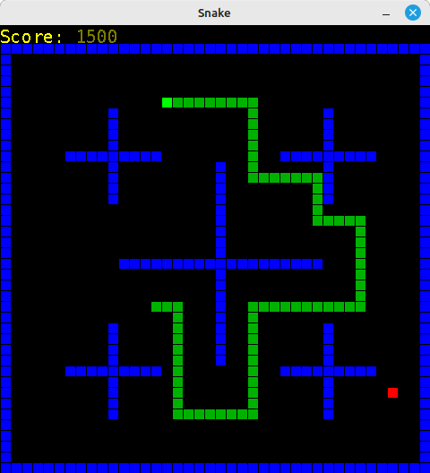

# Snake

A basic implementation of Snake in Java.



## Why Write It?

I wrote this around July of 2023 while preparing to
apply/transfer to a developer position at the company
I was currently working for at the time.  I've dabbled
with simple games learning how to program back in middle
school, but I figured this was a good project to review
Java, as I was extensively working with JavaScript writing
Mirth Connect channels in my current position at the time.
Working on this project gave me a decent opportunity to
play around with Java's [Stream API][java-stream-api], and
examine its functional programming capabilities.

## The Challenge (for Myself)

For this particular implementation, I challenged myself to
not use `for` loops if an alternative existed within the Stream
API.  This also forced me to get really comfortable with
lambda expressions and
[functional interfaces][java-functional-interfaces].

## Requirements

1. JDK 8 or higher.
   * I personally recommend
     [Eclipse Temurin][eclipse-temurin-8-downloads] to keep
     things simple.
   * __If you are worried about conflicting JDK versions__,
     I would recommend employing a strategy that allows you
     to have multiple JDKs coexist on the same machine:
     * **\*nix**
       * Use [jenv][jenv-homepage] and/or [SDKMAN!][sdkman-homepage]
         to install your JDKs.
     * **Windows**
       * You could install your JDKs by version to different directories,
         and symlink `C:\Java` to the current installation you wish
         to use.
       * Use Java exclusively in an environment like
         [MSYS2][msys2-homepage] with **native symlinks enabled**,
         and then use [jenv][jenv-homepage] and/or
         [SDKMAN!][sdkman-homepage] to install your JDKs in your
         MSYS2 environment.
         * _This technique still allows usage of Java from
           Windows directly, but is out of the scope of this
           document._

2. [Apache Maven][maven-homepage].
   * If you use [SDKMAN!][sdkman-homepage], you can use it to
     install Maven.

## How to Build

Assuming the requirements [above](#requirements) are met:

1. Clone this repository, and change into that directory if you
   haven't done so already:
   ```sh
   # Cloning to ./snake isn't mandatory, but it makes things easier
   git clone https://github.com/thepeoplescoder/java--snake snake
   cd snake
   ```

2. Use Maven to compile everything:
   ```sh
   mvn package
   ```

3. Afterwards, you should have an executable `.jar` located at
   `./target/snake-1.0-SNAPSHOT.jar`.

## How to Run

After [building](#how-to-build), you can run the app:

* via the `.jar` directly:
  ```sh
  java -jar target/snake-1.0-SNAPSHOT.jar
  ```
  * The `.jar` is completely self-contained and can be
    moved anywhere.

* via Maven:
  ```
  mvn exec:java
  ```

## Controls

* Use the **arrow keys** to move around.
* **P** pauses/unpauses the game.
* **Q/Escape** quits the game.
* On game over, press **Enter** to restart.

## Current Features

* Things you would expect from your standard Snake game:
  * If you eat an apple, the snake grows
  * If you crash into a wall, game over
  * If you crash into yourself, game over
  * Snake is randomly positioned initially
    * This is done such that the snake doesn't start:
      * in an invalid position
      * crashing into an obstacle immediately
* On game over, the messages range from dry humor to
  lightly taunting
  * When I was working on this game, I was playing a lot of
    [Risk of Rain 2](https://riskofrain.com) at the time.
    Their game over messages do the same, so I drew inspiration
    from it.
* Body is deliberately slightly darker than head
  so direction of travel is clear
* Internally, the game is structured such that the
  game logic is separate from how it is displayed
  to the user.
  * Currently, only a Swing implementation exists.

## Current Limitations

* The game deliberately crashes upon eating 999 apples.
  * This can be changed by modifying the value of
    `com.thepeoplescoder.snake.Shared.Settings.Game.applesPerLevel`.

## Project Roadmap
* Show number of apples collected
* Implement multiple lives
* Implement multiple levels
* Implement a cross-platform version that works on the terminal,
  using text to emulate pixel graphics

[java-stream-api]:              https://docs.oracle.com/javase/8/docs/api/java/util/stream/package-summary.html#package.description
[java-functional-interfaces]:   https://docs.oracle.com/javase/8/docs/api/java/util/function/package-summary.html#package.description
[jenv-homepage]:                https://www.jenv.be/
[sdkman-homepage]:              https://sdkman.io/
[msys2-homepage]:               https://www.msys2.org/
[eclipse-temurin-8-downloads]:  https://adoptium.net/temurin/releases/?version=8
[maven-homepage]:               https://maven.apache.org/